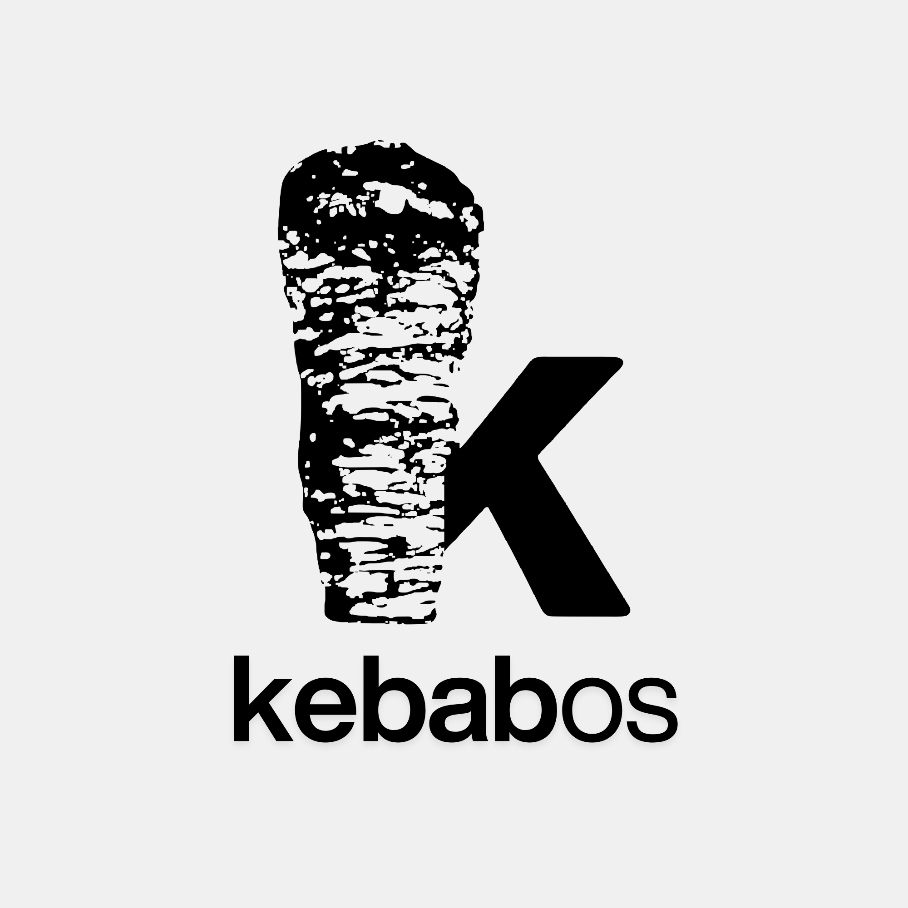

<div align="center">
  <a href="https://kebab.is-a.software"></a>
  <h1>kebab-shell</h1>
  <b>Lightweight, robust shell enviroment</b>
</div>

---

## What is this?

Kebab-shell is a lightweight, robust shell enviroment, that you can execute basic JavaScript commands on. Kebab-shell is designed to be forked and contributed to, although it requires [cloudfare workers](https://workers.dev).


## Quick Start

Follow these steps to quickly set up kebab-shell:

1. Create a new file called `client.py`
2. Copy [this code](client/client.py), paste it into the file
3. Make sure you have installed the [dependencies](#dependencies)
4. Run this code:

```python
python3 client.py
```

If you have followed these steps correctly, kebab-shell, should atomatically load. If this does not happen, raise an issue on GitHub.


## Dependencies

Kebab-shell requires these dependencies:

- Python3 (install latest version of python)
- Socket
- base64
- SSL
- os and sys compatibility
- struct
- urllib
- select

Most of these are built-in, and come with all python packages. Client preview:

```python
import socket, ssl, base64, os, struct, urllib.parse, select, sys
```


## License

kebab-shell is under the [MIT License](LICENSE).
